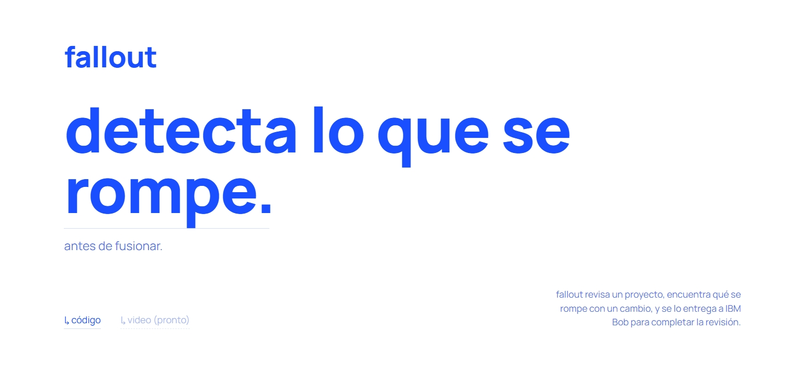

<div align="center">

# fallout



</div>

<div align="justify">


A blast-radius and architecture guardian for pull requests, built to be used alongside **IBM Bob**. This is a private project: it is not deployed or published on any external service.

A typical code review only looks at the diff. The impact of a change almost always lies outside of it: other modules that import what was changed, OpenAPI documentation and specifications that still describe the previous behavior, configuration settings, and architectural decisions that the change contradicts without anyone noticing. `fallout` finds these candidates with concrete evidence (file and line), in any local Git project, without the need for prior configuration. From there, IBM Bob does what a script cannot: it reads the architecture documentation, divides the work among three specialized roles that run in parallel, writes the missing tests, and proposes the fix.

```
guardian scan <folder>   ->  risk table for each project in the folder
guardian prompt           ->  analysis + message ready to paste into Bob
Bob (mode: PR Guardian)   ->  3 subagents running in parallel -> verdict + branch with the fix
```

---

## What it detects (JavaScript/TypeScript and Python, any folder structure)

- Removed exports and functions whose signature has changed, if any other file still uses them (even through re-exports like `barrel` or `__init__`).
- Removed model fields (Django, SQLAlchemy, Prisma) that are still referenced elsewhere.
- Values that were removed during the change (IDs, prefixes, keys) but are still assumed to be present in the documentation, specifications, configuration, or code in other files.
- Differences between the code and its OpenAPI specification: routes that were removed but are still documented, and new routes that were not documented.
- New environment variables missing from `.env.example`.
- Modules that have changed and are not covered by any tests; optionally, run the project’s own tests with `--run-tests`.

---

## Getting Started

```bash
npm install
node bin/guardian.mjs install-modes                  # once: sets up Bob’s modes in any project
node bin/guardian.mjs scan “/path/to/your/projects”
node bin/guardian.mjs prompt --repo “/path/to/your-project” --copy
```

> Complete, step-by-step guide: [`docs/USER_GUIDE.md`](docs/USER_GUIDE.md).

---

## How It Works

The program never writes to the projects it analyzes, except for a hidden folder, `.guardian/`, which is automatically ignored by Git; `scan` doesn’t even touch that—it saves everything to the `reports/` folder in this same repository. Bob’s modes follow the same principle of least privilege as the rest of the design: the analyst only reads and executes commands, the documentation guardian edits only docs and specifications, the test synthesizer edits only test files, and production code is never modified directly—it is only proposed as a patch that a person decides whether or not to apply. Fixes also do not touch the original branch: they are always kept in a new branch, `bob/guardian-fix/<branch>`.

---

## Structure

```
bin/        the command-line tool
src/        the analysis engine
docs/       user guide
styles/    style sheet for the info page (styles/styles.css)
index.html  project info page
.bob/       Bob modes already installed for this project
```

---

## Limitations
This is a static analysis based on heuristics: it finds candidates based on evidence (file and line), but does not prove that something will break. It does not resolve path aliases in complex monorepos, imports that are constructed at runtime, or dependencies between different repositories. That’s what Bob is for: it reads what the script can’t see and reasons about it.

</div>