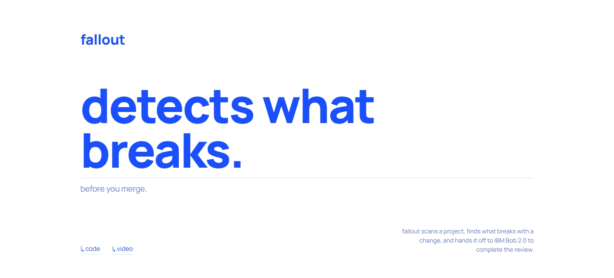
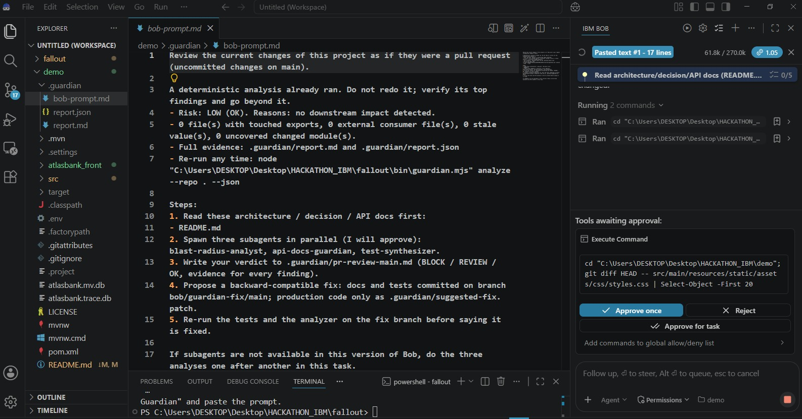
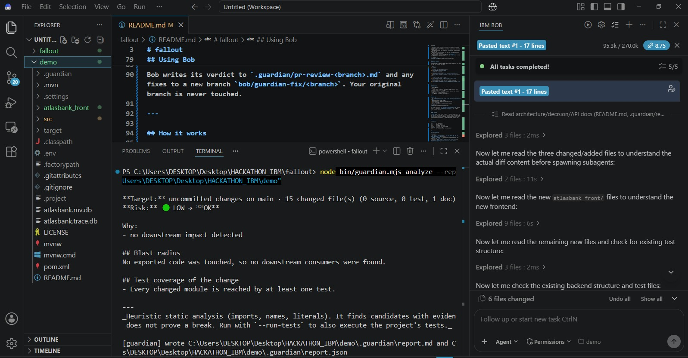
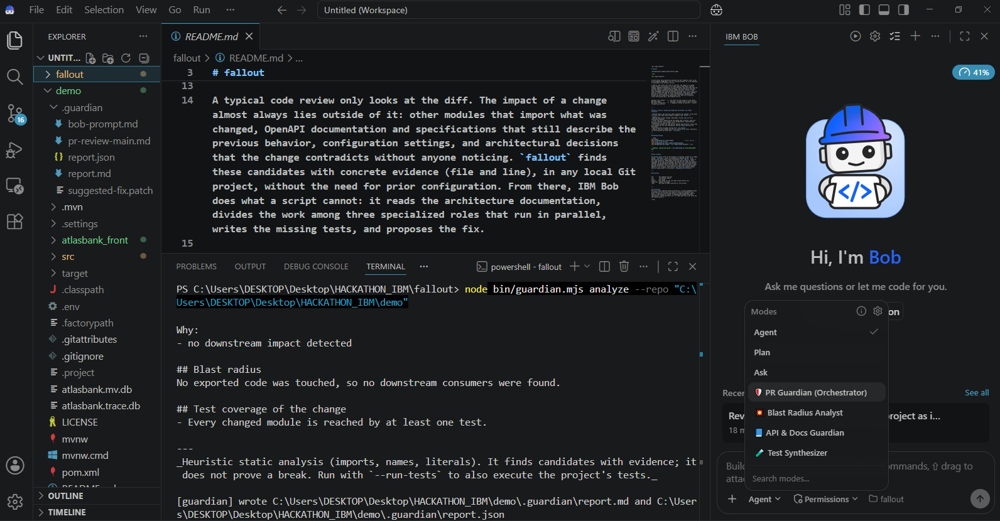

<div align="center">

# fallout

**detects what breaks. before you merge.**

<!-- landing page -->


</div>

---

`fallout` scans any local Git project for the impact of a change — broken imports, drifted docs, untested modules — then hands the result to **IBM Bob** to complete the review.

```
node bin/guardian.mjs analyze [--repo DIR]        →  analyse one project
node bin/guardian.mjs scan <folder>               →  risk report for every repo in the folder
node bin/guardian.mjs prompt --repo <path>        →  analysis + message ready to paste into Bob
node bin/guardian.mjs install-modes               →  install Bob modes (once)
Bob (PR Guardian mode)                            →  3 parallel subagents → verdict + fix branch
```

---

## What it detects

Works on **JavaScript / TypeScript** and **Python**, any folder structure.

- Removed or renamed exports / functions still imported elsewhere (including barrel re-exports)
- Removed model fields (Prisma, SQLAlchemy, Django) still referenced in other files
- Removed values (IDs, keys, prefixes) still assumed present in docs, config, or code
- OpenAPI drift: routes removed from code but still documented, or new routes not yet documented
- New environment variables missing from `.env.example`
- Changed modules with no test coverage — add `--run-tests` to also run the project's own test suite

<!-- terminal -->


---

## Getting started

**Prerequisites:** Node.js and Git. Each project to analyse must be a Git repo with at least one commit.

```bash
# 1 — install
npm install

# 2 — install Bob modes globally (once)
node bin/guardian.mjs install-modes
# → restart Bob after this

# 3 — analyse a single project
node bin/guardian.mjs analyze --repo "C:\path\to\your-project"
# options: --base <branch> | --working | --last <N> | --run-tests | --json

# 4 — scan all repos inside a folder
node bin/guardian.mjs scan "C:\path\to\your-projects-folder"
# options: --depth 3 (default 2) | --run-tests

# 5 — generate the Bob prompt and copy it to the clipboard
node bin/guardian.mjs prompt --repo "C:\path\to\your-project" --copy
```

---

## Risk levels

| Level | Meaning |
|---|---|
| 🔴 HIGH / BLOCK | Something removed or changed is still used elsewhere. Review before merging. |
| 🟠 MEDIUM / REVIEW | Dependants, outdated docs, or code without tests found. |
| 🟢 LOW / OK | No impact detected. |
| ⚪ — | Nothing to compare (no changes). |

<!-- level example -->


---

## Using Bob

1. Run `node bin/guardian.mjs prompt --repo "C:\path\to\your-project" --copy`
2. Open that project folder in Bob
3. Select mode **🛡️ PR Guardian (Orchestrator)**
4. Paste the message
5. Approve the 3 parallel subagents when Bob asks

<!-- agents -->


Bob writes its verdict to `.guardian/pr-review-<branch>.md` and any fixes to a new branch `bob/guardian-fix/<branch>`. Your original branch is never touched.

---

## How it works

`fallout` never writes to the projects it analyses. Scan results go to `reports/` in this repo. Bob's three roles follow least-privilege: the analyst reads and runs commands, the docs guardian touches only docs and specs, the test synthesizer touches only test files. Code fixes are proposed as a patch — you decide whether to apply them.

---

## Structure

```
bin/        CLI entry point
src/        analysis engine
docs/       user guide and assets
estilos/    stylesheet for the info page
index.html  project info page
.bob/       Bob modes installed for this project
```

---

## Troubleshooting

| Error | Fix |
|---|---|
| `not inside a git repository` | `git init && git add . && git commit -m "init"` in that project |
| `nothing to compare` | No changes found. Create a branch, make a change, or use `--last 1` |
| Modes don't appear in Bob | Restart the Bob window. Or install per-project: `node bin/guardian.mjs install-modes --project "C:\path\to\project"` |
| Path with spaces | Wrap the path in quotes |

---

## Limitations

Static heuristic analysis — finds candidates with evidence (file + line) but does not prove a break. Does not resolve path aliases in complex monorepos, runtime-constructed imports, or cross-repo dependencies. That reasoning gap is what Bob covers.
